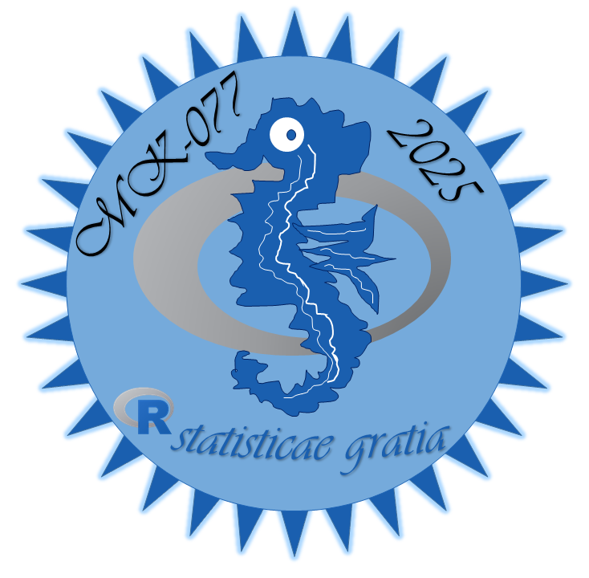

## "About this course"

This is an introductory course to linear regression with specific focus on nutritional science. The target group are master students.

# "Software used"

The course was created with R version 4.5.1

# "Learning goals"

Students understand and can run linear regression analysis

# "Course Pages"
- [Course for Linear Regression (Nutritional Science)](https://diler-digitell.github.io/DiLER_digital_literacy_course/)

Credit goes to the original G0RELLA template lectures.

### "I have some questions..."

[Open an issue]() on this repository and someone will try and get back to you as soon as possible!
